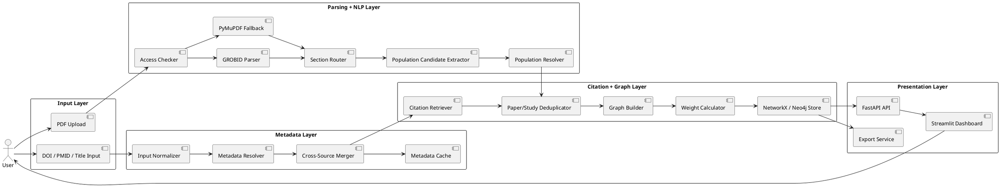

# Project Requirement Document (PRD)

## Project Name

**Confidence-Aware Citation Lineage and Study-Scale Knowledge Graph System**

## Short Name

**CiteGraph-NLP**

## Version

**v1.0 — Cursor Build Specification**

## Purpose of This Document

This PRD defines the full technical and functional requirements for building a working prototype of the revised NLP project. It is designed to be given directly to Cursor or another coding assistant so that it can generate the full project structure, backend modules, database schema, services, dashboard, and evaluation utilities.

The project should be implemented as a realistic prototype, not as an overclaimed research system. It must explicitly handle uncertainty, missing data, incomplete citation coverage, and ambiguous sample-size extraction.

---

# 1. Product Summary

## 1.1 Problem

Researchers often need to understand how a research idea evolved across scientific literature. A paper may cite many earlier papers, and those earlier papers may cite even older work. Existing search systems show papers and citation counts, but they do not clearly show citation lineage, probable foundational papers, or evidence strength based on study size.

In biomedical and clinical research, population size is an important evidence signal. However, automatically extracting the correct sample size from a paper is difficult because papers mention many different numeric values such as screened patients, enrolled patients, randomized participants, analyzed participants, arm sizes, event counts, and follow-up counts.

## 1.2 Proposed Solution

Build a Python-based NLP and Knowledge Graph system that:

1. Accepts a research paper identifier or PDF.
2. Resolves metadata using scholarly APIs before parsing the PDF.
3. Retrieves backward and forward citation relationships.
4. Extracts candidate population/sample-size values from available full text or abstracts.
5. Assigns semantic labels and confidence scores to extracted population values.
6. Builds a study-aware Knowledge Graph separating Paper, Study, Journal, PopulationObservation, and CitationEdge entities.
7. Ranks citation paths using confidence-aware weights.
8. Visualizes probable foundational papers and evidence-rich citation paths.

## 1.3 Key Feasibility Decision

The system must **not** claim to find the absolute original parent paper or perfectly extract every sample size. It must identify **probable foundational papers** and **confidence-aware study-size signals**.

---

# 2. Product Goals

## 2.1 Primary Goals

- Build an end-to-end prototype for biomedical/clinical citation-lineage analysis.
- Use identifier-first metadata resolution through public scholarly APIs.
- Parse PDFs only when full text is legally available or provided by the user.
- Extract population-size candidates with semantic labels and confidence scores.
- Build a directed graph of papers, studies, journals, population observations, and citation edges.
- Rank citation paths using normalized population score, journal/source metric, and extraction confidence.
- Provide a dashboard for visualizing graph structure, top foundational papers, and evidence-weighted paths.

## 2.2 Secondary Goals

- Cache API responses to reduce repeated calls.
- Store provenance for every metadata field, citation edge, and extracted population value.
- Support metadata-only mode when full text is unavailable.
- Export results as JSON, CSV, GraphML, and optionally Neo4j Cypher.
- Provide evaluation scripts for metadata quality, citation retrieval, and population extraction accuracy.

## 2.3 Non-Goals

The system should not attempt to:

- Guarantee discovery of the absolute first paper in a research area.
- Guarantee complete citation coverage from all scholarly databases.
- Treat every numeric mention as a population size.
- Rely only on Journal Impact Factor.
- Scrape or store copyrighted full text without permission.
- Build a production-scale 100k+ paper ingestion pipeline in the MVP.

---

# 3. Target Users

## 3.1 Primary Users

- NLP students building a course project.
- Researchers analyzing biomedical or clinical literature.
- Academic reviewers who want a visual citation lineage.

## 3.2 User Personas

### Student Developer

Needs a working prototype with clear modules, APIs, data models, and demo-ready visualization.

### Researcher

Wants to input a DOI or PDF and understand which earlier papers are probable foundational works.

### Evaluator / Instructor

Wants to see realistic NLP methods, graph modeling, uncertainty handling, and defensible project scope.

---

# 4. MVP Scope

## 4.1 MVP Inputs

The MVP must support at least:

1. DOI input
2. Paper title input
3. PMID input if available
4. PDF upload

PMCID and NCT ID support should be included if easy, but they can be treated as enhancement features.

## 4.2 MVP Outputs

The system must output:

1. Resolved paper metadata
2. Backward references
3. Forward citations, where available
4. Candidate population-size mentions
5. Selected effective population size, called `N_eff`
6. Confidence score for `N_eff`
7. Knowledge Graph visualization
8. Ranked probable foundational papers
9. Ranked citation paths
10. Exportable JSON report

## 4.3 MVP Scale

The MVP should handle:

- 1 seed paper
- Depth-limited traversal up to 2 levels by default
- Up to 100 total papers in one run
- Local development environment
- Optional Neo4j backend
- NetworkX as default graph engine

---

# 5. Recommended Tech Stack

## 5.1 Backend

- Python 3.11+
- FastAPI for REST API
- Pydantic v2 for schemas and validation
- HTTPX for async API calls
- Tenacity for retries
- SQLAlchemy or SQLModel for relational cache/storage
- SQLite for local MVP storage
- PostgreSQL optional for future upgrade
- NetworkX for graph construction and analytics
- PyVis for graph visualization export
- Pandas and NumPy for processing

## 5.2 NLP and Parsing

- Regex-based numeric candidate extraction
- spaCy for sentence splitting and lightweight NLP
- PyMuPDF for PDF text extraction fallback
- GROBID via Docker service for scholarly PDF parsing
- Optional Hugging Face Transformers later for typed candidate classification

## 5.3 External APIs

Use a pluggable provider design.

Required MVP providers:

- OpenAlex
- Crossref

Recommended biomedical providers:

- Europe PMC
- PubMed / NCBI E-utilities

Optional enrichment providers:

- Semantic Scholar
- ClinicalTrials.gov
- Unpaywall

## 5.4 Frontend / Dashboard

Use Streamlit for MVP because it is fast for Python-based data apps.

Dashboard must show:

- Input form
- Metadata summary
- Population extraction table
- Ranked foundational papers
- Graph visualization
- Citation path ranking
- Export buttons

## 5.5 Infrastructure

- Docker Compose for optional services
- GROBID container
- Neo4j container optional
- `.env` for API keys and configuration
- Local file storage for uploaded PDFs and cached artifacts

---

# 6. System Architecture

## 6.1 High-Level Flow

1. User enters DOI/title/PMID or uploads PDF.
2. System normalizes the input.
3. Metadata Resolver queries APIs.
4. Metadata Merger combines fields with provenance.
5. Access Checker determines whether full text is available or whether PDF was user-provided.
6. Parser extracts structured text if available.
7. NLP module extracts population candidates.
8. Population Resolver selects `N_eff` and confidence.
9. Citation Module retrieves references and citations.
10. Graph Builder creates paper/study/venue/population/citation objects.
11. Weight Calculator computes edge scores.
12. Dashboard displays and exports results.

## 6.2 Architecture Diagram



---

# 7. Functional Requirements

## 7.1 Input Module

### Requirement FR-001

The system must allow users to submit one of the following:

- DOI
- PMID
- PMCID
- Paper title
- PDF file

### Requirement FR-002

The system must normalize identifiers into a consistent internal format.

Examples:

- `https://doi.org/10.xxxx/yyyy` → `10.xxxx/yyyy`
- `doi:10.xxxx/yyyy` → `10.xxxx/yyyy`
- `PMID: 12345678` → `12345678`

### Requirement FR-003

If input is PDF-only, the system must attempt to extract title and DOI from the PDF header before querying APIs.

### Acceptance Criteria

- DOI normalization works for URLs, lowercase/uppercase DOI strings, and `doi:` prefixes.
- PDF upload stores file in `/data/uploads/`.
- Invalid inputs return a clear validation error.

---

## 7.2 Metadata Resolver

### Requirement FR-004

The system must query OpenAlex for paper metadata.

### Requirement FR-005

The system must query Crossref for DOI metadata when a DOI is available.

### Requirement FR-006

The system should query Europe PMC or PubMed when PMID/PMCID or biomedical metadata is available.

### Requirement FR-007

The system must merge metadata from multiple providers using deterministic precedence rules.

### Field Precedence Rules

| Field | Preferred Source | Fallback |
|---|---|---|
| DOI | Crossref | OpenAlex, Europe PMC |
| Title | Crossref/OpenAlex agreement | OpenAlex, Europe PMC |
| Authors | Crossref | OpenAlex, PubMed |
| Year | Crossref | OpenAlex, Europe PMC |
| Journal | Crossref | OpenAlex, PubMed |
| Abstract | PubMed/Europe PMC | OpenAlex/Crossref if available |
| References | OpenAlex | Europe PMC, Crossref |
| Citations | OpenAlex | Europe PMC, Semantic Scholar |
| Source metric | OpenAlex source metrics | CiteScore/SJR/JIF if manually provided |

### Requirement FR-008

The system must store provenance for every field.

Example:

```json
{
  "title": {
    "value": "Example Paper Title",
    "source": "openalex",
    "confidence": 0.95
  }
}
```

### Acceptance Criteria

- Given a DOI, system returns title, year, authors, journal, DOI, and at least one source URL or provider ID.
- Metadata conflicts are logged.
- API failures do not crash the entire pipeline.

---

## 7.3 API Client Layer

### Requirement FR-009

All external API integrations must be implemented through provider classes that share a common interface.

Interface:

```python
class MetadataProvider(Protocol):
    async def resolve(self, query: PaperQuery) -> ProviderResult: ...
    async def get_references(self, paper_id: str) -> list[CitationRecord]: ...
    async def get_citations(self, paper_id: str) -> list[CitationRecord]: ...
```

### Requirement FR-010

The system must support retries, timeouts, and rate-limit handling.

### Requirement FR-011

The system must cache raw API responses.

### Acceptance Criteria

- Provider failure returns a structured error.
- Cached responses are reused on repeated calls.
- Logs include provider name, endpoint, status, and duration.

---

## 7.4 Full-Text Access and PDF Parsing

### Requirement FR-012

The system must check whether full text is legally available before attempting automatic retrieval.

### Requirement FR-013

If the user uploads a PDF, the system may parse the uploaded file for local analysis.

### Requirement FR-014

GROBID should be used as the primary parser when available.

### Requirement FR-015

PyMuPDF must be used as a fallback parser.

### Requirement FR-016

The parser must output structured sections when possible:

- Title
- Abstract
- Introduction
- Methods
- Results
- Discussion
- References
- Tables text, if available

### Requirement FR-017

The parser must assign a `parse_quality_score` from 0 to 1.

Suggested quality rules:

- Title extracted: +0.20
- Abstract extracted: +0.20
- References extracted: +0.20
- At least 1000 characters extracted: +0.20
- Section headings detected: +0.20

### Acceptance Criteria

- System can parse a born-digital PDF.
- System can fallback to PyMuPDF if GROBID is unavailable.
- System marks low-quality parses rather than silently failing.

---

## 7.5 Population Candidate Extraction

### Requirement FR-018

The system must extract numeric candidates likely to represent population/sample-size values.

### Required Candidate Patterns

The extractor must detect patterns like:

- `N = 10,000`
- `n=245`
- `10,000 patients`
- `25,000 participants`
- `sample size of 5,432`
- `cohort of 100,000 individuals`
- `randomized 8,000 patients`
- `enrolled 3,200 participants`
- `4,000 in the treatment group`
- `3,500 in the control group`

### Requirement FR-019

Each candidate must include:

- Raw text span
- Numeric value
- Unit noun, if found
- Surrounding sentence
- Section name
- Start/end character offsets if available
- Extraction method
- Initial confidence

### Requirement FR-020

Candidate values must be semantically classified into one of the following types:

```text
TOTAL_RANDOMIZED
TOTAL_ANALYZED
TOTAL_ENROLLED
ARM_SIZE
SCREENED
COMPLETERS
EVENT_COUNT
FOLLOWUP_COUNT
SAMPLE_SIZE_GENERIC
UNKNOWN_NUMERIC
```

### Requirement FR-021

Event counts must not be selected as `N_eff` unless no better candidate exists and the system marks the result as low confidence.

### Requirement FR-022

Section-based scoring must prioritize candidates from:

1. Abstract
2. Methods
3. Results
4. Tables / participant flow text
5. Other sections

### Candidate Scoring Formula

Use this starting formula:

```text
score(candidate) =
    0.40 * pattern_score
  + 0.25 * semantic_type_score
  + 0.20 * section_score
  + 0.10 * repetition_score
  + 0.05 * metadata_bonus
```

### Semantic Type Priority

```text
TOTAL_RANDOMIZED > TOTAL_ANALYZED > TOTAL_ENROLLED > SAMPLE_SIZE_GENERIC > ARM_SIZE > SCREENED > COMPLETERS > FOLLOWUP_COUNT > EVENT_COUNT > UNKNOWN_NUMERIC
```

### Acceptance Criteria

- Extractor returns a candidate table for each parsed paper.
- Each candidate has type, value, sentence, section, and confidence.
- Candidate extractor avoids obvious false positives like years, p-values, percentages, page numbers, and confidence intervals.

---

## 7.6 Population Resolver

### Requirement FR-023

The system must select one canonical effective population size called `N_eff`.

### Requirement FR-024

The selected `N_eff` must include:

- Value
- Semantic type
- Confidence score
- Evidence sentence
- Source section
- Explanation

Example:

```json
{
  "n_eff": 8500,
  "semantic_type": "TOTAL_RANDOMIZED",
  "confidence": 0.86,
  "evidence": "A total of 8,500 patients were randomized...",
  "section": "Methods",
  "explanation": "Selected because it is a randomized total found in the Methods section and repeated in the Abstract."
}
```

### Requirement FR-025

If the system is uncertain, it must return `status: ambiguous` instead of forcing a value.

### Requirement FR-026

If arm sizes are detected and no total is detected, the resolver should compute a possible total by summing arm sizes only when:

- At least two arm-size candidates are detected.
- They occur close together.
- They are in the same section or table.
- Their semantic type is `ARM_SIZE`.

### Acceptance Criteria

- Resolver returns `N_eff` with confidence.
- Ambiguous cases are clearly labeled.
- Event counts and years are not selected as population sizes.

---

## 7.7 Citation Retrieval

### Requirement FR-027

The system must retrieve backward references for a paper.

### Requirement FR-028

The system should retrieve forward citations when available.

### Requirement FR-029

The traversal depth must be configurable.

Default:

```text
backward_depth = 2
forward_depth = 1
max_total_papers = 100
```

### Requirement FR-030

Citation edges must store provenance.

Example:

```json
{
  "source_paper_id": "paper_a",
  "target_paper_id": "paper_b",
  "relation": "CITES",
  "providers": ["openalex", "europe_pmc"],
  "confidence": 0.95
}
```

### Requirement FR-031

The system must deduplicate papers by DOI first, then PMID/PMCID, then normalized title-year matching.

### Acceptance Criteria

- Citation traversal does not exceed configured limits.
- Duplicate papers are merged.
- Every citation edge stores at least one provider/source.

---

## 7.8 Study-Aware Knowledge Graph

### Requirement FR-032

The graph must separate Paper and Study entities.

### Requirement FR-033

If no registry/study ID is available, the system must create an inferred Study node for the paper.

### Requirement FR-034

The graph must support the following node types:

- Paper
- Study
- PopulationObservation
- Journal/Venue
- Author, optional for MVP

### Requirement FR-035

The graph must support the following edge types:

- `PAPER_CITES_PAPER`
- `PAPER_REPORTS_STUDY`
- `STUDY_HAS_POPULATION_OBSERVATION`
- `PAPER_PUBLISHED_IN_JOURNAL`
- `PAPER_WRITTEN_BY_AUTHOR`, optional

### Acceptance Criteria

- Graph can be built in NetworkX.
- Graph can be exported to JSON and GraphML.
- Graph includes node and edge attributes.

---

## 7.9 Edge Weighting

### Requirement FR-036

The system must calculate citation edge weights using cited-paper/cited-study evidence.

### Base Formula

```text
base_weight = alpha * N_score + beta * journal_score
final_weight = base_weight * confidence_score
```

Default values:

```text
alpha = 0.75
beta = 0.25
```

### Requirement FR-037

`N_score` must be normalized using logarithmic scaling.

```text
N_score = log1p(N_eff) / log1p(N_reference)
```

Where:

```text
N_reference = 100000
```

Clip result to `[0, 1]`.

### Requirement FR-038

`journal_score` must use the following fallback order:

1. Manually provided JIF, if available
2. CiteScore, if integrated
3. OpenAlex 2-year mean citedness or source metric
4. Default neutral score of `0.5`

### Requirement FR-039

If population confidence is low, the final weight must be reduced.

### Acceptance Criteria

- Every citation edge has `base_weight`, `final_weight`, `N_score`, `journal_score`, and `confidence_score`.
- Missing population data does not crash the system.
- Missing journal metric uses neutral fallback.

---

## 7.10 Ranking and Analytics

### Requirement FR-040

The system must rank probable foundational papers.

Ranking factors:

- Older publication year
- Number of downstream citation paths from seed
- Weighted in-degree or influence score
- Population-based evidence score
- Confidence score

### Requirement FR-041

The system must rank citation paths from seed paper to older papers.

Path score:

```text
path_score = average(final_edge_weight) * path_confidence * depth_bonus
```

Where:

```text
path_confidence = product(edge_confidence values)
depth_bonus = 1 / sqrt(path_length)
```

### Requirement FR-042

The system must expose top results:

- Top 10 probable foundational papers
- Top 10 strongest citation paths
- Top 10 papers by population evidence
- Top ambiguous population extractions

### Acceptance Criteria

- Ranking functions return deterministic output.
- Results include explanations, not just scores.
- Dashboard displays ranked tables.

---

## 7.11 Dashboard

### Requirement FR-043

Create a Streamlit dashboard.

### Required Pages

1. **Home / Input**
2. **Metadata Results**
3. **Population Extraction**
4. **Citation Graph**
5. **Ranked Foundational Papers**
6. **Export Report**

### Requirement FR-044

Dashboard must allow user to configure:

- DOI/title/PMID/PDF input
- Backward traversal depth
- Forward traversal depth
- Max papers
- Use PDF parsing on/off
- Use Semantic Scholar enrichment on/off
- Use Neo4j on/off, optional

### Requirement FR-045

Graph visualization must show:

- Seed paper highlighted
- Citation direction
- Edge weights
- Node labels
- Confidence indicators

### Acceptance Criteria

- User can run end-to-end pipeline from dashboard.
- User can inspect extracted candidates.
- User can export report JSON.

---

## 7.12 Exporting

### Requirement FR-046

System must export:

- `metadata.json`
- `population_candidates.csv`
- `graph.json`
- `graph.graphml`
- `ranked_foundational_papers.csv`
- `ranked_paths.csv`
- `report.md`

### Acceptance Criteria

- Export files are saved under `/data/exports/{run_id}/`.
- Dashboard provides download links.

---

# 8. Non-Functional Requirements

## 8.1 Performance

- MVP should process one DOI seed with max 100 papers in under 5 minutes, excluding slow external API delays.
- PDF parsing for one paper should complete in under 60 seconds if GROBID is running and PDF is born-digital.

## 8.2 Reliability

- API failures should be non-fatal.
- Pipeline should continue with partial data.
- Every run should produce a status report.

## 8.3 Reproducibility

- Cache raw API responses.
- Store run configuration.
- Store timestamps and provider versions if available.

## 8.4 Legal and Ethical Safety

- Do not automatically scrape paywalled full text.
- Do not redistribute full copyrighted papers.
- Store extracted snippets only when needed for evidence display.
- Make uncertainty visible.
- Do not treat journal metrics as the only quality signal.

## 8.5 Maintainability

- Use modular provider classes.
- Use typed Pydantic models.
- Use tests for each module.
- Keep business logic out of the dashboard.

---

# 9. Data Models

## 9.1 Core Pydantic Models

Create these models in `src/citegraph/models/`.

### PaperQuery

```python
class PaperQuery(BaseModel):
    query_type: Literal["doi", "pmid", "pmcid", "title", "pdf"]
    value: str
    pdf_path: str | None = None
```

### Paper

```python
class Paper(BaseModel):
    paper_id: str
    doi: str | None = None
    pmid: str | None = None
    pmcid: str | None = None
    title: str
    authors: list[str] = []
    year: int | None = None
    journal: str | None = None
    abstract: str | None = None
    source_ids: dict[str, str] = {}
    metadata_confidence: float = 0.0
    provenance: dict[str, Any] = {}
```

### Study

```python
class Study(BaseModel):
    study_id: str
    registry_id: str | None = None
    design: str | None = None
    domain: str | None = None
    inferred: bool = True
    dedupe_confidence: float = 0.0
```

### PopulationCandidate

```python
class PopulationCandidate(BaseModel):
    candidate_id: str
    paper_id: str
    value: int
    raw_text: str
    sentence: str
    section: str | None = None
    semantic_type: Literal[
        "TOTAL_RANDOMIZED",
        "TOTAL_ANALYZED",
        "TOTAL_ENROLLED",
        "ARM_SIZE",
        "SCREENED",
        "COMPLETERS",
        "EVENT_COUNT",
        "FOLLOWUP_COUNT",
        "SAMPLE_SIZE_GENERIC",
        "UNKNOWN_NUMERIC"
    ]
    start_char: int | None = None
    end_char: int | None = None
    extraction_method: str
    confidence: float
```

### PopulationResolution

```python
class PopulationResolution(BaseModel):
    paper_id: str
    study_id: str | None = None
    n_eff: int | None = None
    semantic_type: str | None = None
    confidence: float
    status: Literal["resolved", "ambiguous", "missing"]
    selected_candidate_id: str | None = None
    explanation: str
```

### CitationEdge

```python
class CitationEdge(BaseModel):
    edge_id: str
    source_paper_id: str
    target_paper_id: str
    relation: Literal["CITES"] = "CITES"
    providers: list[str]
    confidence: float
    retrieved_at: datetime
    base_weight: float | None = None
    final_weight: float | None = None
    n_score: float | None = None
    journal_score: float | None = None
```

### RunResult

```python
class RunResult(BaseModel):
    run_id: str
    seed_paper_id: str
    papers: list[Paper]
    studies: list[Study]
    population_candidates: list[PopulationCandidate]
    population_resolutions: list[PopulationResolution]
    citation_edges: list[CitationEdge]
    ranked_foundational_papers: list[dict[str, Any]]
    ranked_paths: list[dict[str, Any]]
    warnings: list[str]
    created_at: datetime
```

---

# 10. API Specification

Build a FastAPI backend.

## 10.1 Endpoints

### Health Check

```http
GET /health
```

Response:

```json
{
  "status": "ok"
}
```

### Start Ingestion

```http
POST /api/runs
```

Request:

```json
{
  "query_type": "doi",
  "value": "10.xxxx/example",
  "backward_depth": 2,
  "forward_depth": 1,
  "max_total_papers": 100,
  "use_pdf_parsing": true,
  "use_semantic_scholar": false
}
```

Response:

```json
{
  "run_id": "run_abc123",
  "status": "started"
}
```

For MVP, this can run synchronously and return completed results. For better UX, use a background task.

### Get Run Result

```http
GET /api/runs/{run_id}
```

### Get Graph JSON

```http
GET /api/runs/{run_id}/graph
```

### Get Population Candidates

```http
GET /api/runs/{run_id}/population-candidates
```

### Export Report

```http
GET /api/runs/{run_id}/export/{format}
```

Supported formats:

```text
json
csv
graphml
markdown
```

---

# 11. Project Structure

Cursor should create the following structure.

```text
citegraph-nlp/
├── README.md
├── PRD.md
├── pyproject.toml
├── requirements.txt
├── .env.example
├── .gitignore
├── docker-compose.yml
├── Makefile
│
├── src/
│   └── citegraph/
│       ├── __init__.py
│       ├── config.py
│       ├── logging_config.py
│       │
│       ├── api/
│       │   ├── __init__.py
│       │   ├── main.py
│       │   ├── routes.py
│       │   └── dependencies.py
│       │
│       ├── models/
│       │   ├── __init__.py
│       │   ├── paper.py
│       │   ├── study.py
│       │   ├── population.py
│       │   ├── citation.py
│       │   ├── graph.py
│       │   └── run.py
│       │
│       ├── input/
│       │   ├── __init__.py
│       │   ├── normalizer.py
│       │   └── validators.py
│       │
│       ├── providers/
│       │   ├── __init__.py
│       │   ├── base.py
│       │   ├── openalex.py
│       │   ├── crossref.py
│       │   ├── europe_pmc.py
│       │   ├── pubmed.py
│       │   ├── semantic_scholar.py
│       │   ├── clinical_trials.py
│       │   └── unpaywall.py
│       │
│       ├── metadata/
│       │   ├── __init__.py
│       │   ├── resolver.py
│       │   ├── merger.py
│       │   └── deduplicator.py
│       │
│       ├── parsing/
│       │   ├── __init__.py
│       │   ├── access_checker.py
│       │   ├── grobid_client.py
│       │   ├── pymupdf_parser.py
│       │   ├── section_router.py
│       │   └── quality.py
│       │
│       ├── nlp/
│       │   ├── __init__.py
│       │   ├── sentence_splitter.py
│       │   ├── population_patterns.py
│       │   ├── population_extractor.py
│       │   ├── population_classifier.py
│       │   └── population_resolver.py
│       │
│       ├── citations/
│       │   ├── __init__.py
│       │   ├── retriever.py
│       │   ├── traversal.py
│       │   └── edge_confidence.py
│       │
│       ├── graph/
│       │   ├── __init__.py
│       │   ├── builder.py
│       │   ├── weighting.py
│       │   ├── analytics.py
│       │   ├── exporters.py
│       │   └── neo4j_store.py
│       │
│       ├── storage/
│       │   ├── __init__.py
│       │   ├── cache.py
│       │   ├── sqlite_store.py
│       │   └── file_store.py
│       │
│       ├── pipeline/
│       │   ├── __init__.py
│       │   ├── orchestrator.py
│       │   ├── run_config.py
│       │   └── status.py
│       │
│       ├── evaluation/
│       │   ├── __init__.py
│       │   ├── metadata_eval.py
│       │   ├── population_eval.py
│       │   ├── citation_eval.py
│       │   └── ranking_eval.py
│       │
│       └── utils/
│           ├── __init__.py
│           ├── ids.py
│           ├── text.py
│           ├── math.py
│           └── time.py
│
├── dashboard/
│   ├── app.py
│   ├── pages/
│   │   ├── 1_Metadata.py
│   │   ├── 2_Population_Extraction.py
│   │   ├── 3_Citation_Graph.py
│   │   ├── 4_Rankings.py
│   │   └── 5_Export.py
│   └── components/
│       ├── graph_view.py
│       ├── tables.py
│       └── cards.py
│
├── scripts/
│   ├── run_pipeline.py
│   ├── ingest_seed.py
│   ├── export_graph.py
│   ├── evaluate_population.py
│   └── demo.py
│
├── tests/
│   ├── test_input_normalizer.py
│   ├── test_population_patterns.py
│   ├── test_population_resolver.py
│   ├── test_weighting.py
│   ├── test_deduplicator.py
│   └── test_graph_builder.py
│
├── data/
│   ├── uploads/
│   ├── cache/
│   ├── parsed/
│   ├── exports/
│   └── samples/
│
└── docs/
    ├── architecture.md
    ├── api_sources.md
    ├── evaluation_plan.md
    └── plantuml/
        ├── architecture.puml
        ├── data_model.puml
        └── sequence.puml
```

---

# 12. Environment Variables

Create `.env.example`:

```env
APP_ENV=development
LOG_LEVEL=INFO

# API keys are optional for MVP unless provider requires them.
OPENALEX_EMAIL=your_email@example.com
SEMANTIC_SCHOLAR_API_KEY=
NCBI_API_KEY=

# Provider toggles
ENABLE_OPENALEX=true
ENABLE_CROSSREF=true
ENABLE_EUROPE_PMC=true
ENABLE_PUBMED=false
ENABLE_SEMANTIC_SCHOLAR=false
ENABLE_CLINICAL_TRIALS=false
ENABLE_UNPAYWALL=false

# GROBID
GROBID_URL=http://localhost:8070
ENABLE_GROBID=true

# Storage
DATA_DIR=./data
SQLITE_PATH=./data/cache/citegraph.sqlite

# Graph
ENABLE_NEO4J=false
NEO4J_URI=bolt://localhost:7687
NEO4J_USER=neo4j
NEO4J_PASSWORD=password

# Traversal defaults
DEFAULT_BACKWARD_DEPTH=2
DEFAULT_FORWARD_DEPTH=1
DEFAULT_MAX_TOTAL_PAPERS=100

# Weighting defaults
WEIGHT_ALPHA=0.75
WEIGHT_BETA=0.25
N_REFERENCE=100000
```

---

# 13. Docker Compose

Create `docker-compose.yml`:

```yaml
version: "3.9"

services:
  grobid:
    image: lfoppiano/grobid:0.8.0
    container_name: citegraph-grobid
    ports:
      - "8070:8070"

  neo4j:
    image: neo4j:5-community
    container_name: citegraph-neo4j
    ports:
      - "7474:7474"
      - "7687:7687"
    environment:
      - NEO4J_AUTH=neo4j/password
    volumes:
      - neo4j_data:/data
    profiles:
      - neo4j

volumes:
  neo4j_data:
```

---

# 14. Cursor Implementation Instructions

Give Cursor these implementation rules.

## 14.1 Build Order

Cursor should implement in this order:

1. Project scaffolding
2. Pydantic models
3. Configuration and logging
4. Input normalizer
5. OpenAlex provider
6. Crossref provider
7. Metadata resolver and merger
8. Population regex extractor
9. Population resolver
10. Citation retriever and traversal
11. Graph builder with NetworkX
12. Weight calculator
13. Exporters
14. FastAPI routes
15. Streamlit dashboard
16. Tests
17. Demo script
18. README instructions

## 14.2 MVP Behavior

The first complete version must work without GROBID, Neo4j, Semantic Scholar, PubMed, or paid APIs.

Minimum working pipeline:

```text
DOI input
→ OpenAlex + Crossref metadata
→ OpenAlex references
→ abstract-based population extraction if abstract exists
→ NetworkX graph
→ weighted rankings
→ Streamlit visualization
→ JSON/CSV export
```

## 14.3 Coding Rules

- Use type hints everywhere.
- Use Pydantic models for external and internal data.
- Keep provider-specific JSON out of core logic.
- Store raw provider responses in cache.
- Never crash the full run because one provider failed.
- Include unit tests for regex extraction, weighting, and input normalization.
- Use clear error messages.
- Avoid hardcoding API keys.
- Do not add paid API dependencies.

---

# 15. Core Algorithms

## 15.1 Metadata Merge Algorithm

```text
Input: ProviderResult objects from multiple APIs
Output: Merged Paper object with provenance

1. Initialize empty Paper object.
2. For each field, collect candidate values from providers.
3. Normalize values.
4. If values agree, increase confidence.
5. If values conflict, select value by precedence table.
6. Store all source values in provenance.
7. Return merged Paper.
```

## 15.2 Population Extraction Algorithm

```text
Input: structured paper text
Output: list of PopulationCandidate objects

1. Split text into sections.
2. Split sections into sentences.
3. Apply numeric regex patterns.
4. Ignore likely years, percentages, p-values, confidence intervals, page numbers, dates.
5. Extract local context around each number.
6. Detect unit nouns: patients, participants, individuals, subjects, cases, controls.
7. Assign semantic type using lexical cues.
8. Score candidate using pattern, section, type, and repetition.
9. Return candidate list sorted by confidence.
```

## 15.3 Population Resolution Algorithm

```text
Input: candidates
Output: PopulationResolution

1. Remove candidates below minimum confidence.
2. Group candidates by semantic type.
3. Prefer TOTAL_RANDOMIZED, then TOTAL_ANALYZED, then TOTAL_ENROLLED.
4. If no total exists, inspect ARM_SIZE candidates.
5. If arm sizes are close together, sum them and mark as inferred.
6. If top candidates conflict strongly, mark ambiguous.
7. Return selected N_eff, confidence, and explanation.
```

## 15.4 Citation Traversal Algorithm

```text
Input: seed paper, traversal config
Output: paper list and citation edge list

1. Add seed paper to queue.
2. For each depth level:
   a. Retrieve references for each paper.
   b. Retrieve citations if forward traversal enabled.
   c. Normalize and deduplicate papers.
   d. Add citation edges with provenance.
   e. Stop when max paper limit is reached.
3. Return collected papers and edges.
```

## 15.5 Weighting Algorithm

```text
Input: CitationEdge, target Paper/Study, PopulationResolution, JournalMetric
Output: weighted CitationEdge

1. Get target study N_eff.
2. Calculate N_score = log1p(N_eff) / log1p(N_reference).
3. Clip N_score to [0, 1].
4. Get journal_score or neutral 0.5.
5. Calculate base_weight = alpha * N_score + beta * journal_score.
6. Calculate final_weight = base_weight * population_confidence.
7. Store components on edge.
```

---

# 16. Testing Requirements

## 16.1 Unit Tests

Required tests:

- DOI normalization
- PMID normalization
- Population regex extraction
- False positive filtering
- Semantic type classification
- Population resolver selection
- Ambiguous candidate handling
- Edge weighting formula
- Paper deduplication
- Graph node/edge creation

## 16.2 Integration Tests

Use mocked API responses for:

- OpenAlex DOI lookup
- Crossref DOI lookup
- Citation references
- Metadata merge
- End-to-end run with one seed paper

## 16.3 Sample Test Cases

### Population Pattern Test

Input:

```text
A total of 8,500 patients were randomized, with 4,250 assigned to treatment and 4,250 to control.
```

Expected:

```text
N_eff = 8500
semantic_type = TOTAL_RANDOMIZED
confidence >= 0.8
```

### Arm Sum Test

Input:

```text
The treatment group included 300 participants and the control group included 302 participants.
```

Expected:

```text
N_eff = 602
semantic_type = INFERRED_FROM_ARM_SIZE
status = resolved or ambiguous depending confidence
```

### False Positive Test

Input:

```text
The study was published in 2020. The p-value was 0.03 and the confidence interval was 95%.
```

Expected:

```text
No population candidates selected as N_eff.
```

---

# 17. Dashboard UI Requirements

## 17.1 Home Page

Fields:

- Input type dropdown: DOI, PMID, PMCID, Title, PDF
- Input text box
- PDF uploader
- Backward depth slider
- Forward depth slider
- Max papers slider
- Run button

## 17.2 Metadata Page

Show:

- Seed paper metadata
- Provider comparison table
- Missing fields
- Warnings

## 17.3 Population Extraction Page

Show:

- Candidate table
- Selected `N_eff`
- Confidence score
- Explanation
- Ambiguity warnings

## 17.4 Citation Graph Page

Show:

- Interactive PyVis graph
- Node count
- Edge count
- Graph density
- Top connected papers

## 17.5 Rankings Page

Show:

- Top probable foundational papers
- Top weighted citation paths
- Papers with strongest population evidence

## 17.6 Export Page

Show download buttons for:

- JSON report
- CSV tables
- GraphML
- Markdown report

---

# 18. README Requirements

The README must include:

1. Project description
2. Feasibility note
3. Installation steps
4. Docker setup for GROBID
5. `.env` configuration
6. How to run FastAPI
7. How to run Streamlit dashboard
8. How to run CLI demo
9. Example DOI input
10. Output explanation
11. Limitations
12. Ethical/legal note

Example commands:

```bash
python -m venv .venv
source .venv/bin/activate
pip install -r requirements.txt
cp .env.example .env
docker compose up -d grobid
uvicorn citegraph.api.main:app --reload
streamlit run dashboard/app.py
```

CLI example:

```bash
python scripts/run_pipeline.py --doi "10.1000/example" --backward-depth 2 --max-papers 50
```

---

# 19. Requirements.txt

Use this initial dependency list:

```txt
fastapi
uvicorn[standard]
pydantic>=2
pydantic-settings
httpx
tenacity
python-dotenv
sqlalchemy
sqlmodel
networkx
pandas
numpy
streamlit
pyvis
pymupdf
spacy
rapidfuzz
python-multipart
lxml
beautifulsoup4
pytest
pytest-asyncio
respx
rich
```

Optional later:

```txt
neo4j
transformers
torch
scikit-learn
```

---

# 20. Makefile

Create a Makefile:

```makefile
install:
	pip install -r requirements.txt

run-api:
	uvicorn citegraph.api.main:app --reload

run-dashboard:
	streamlit run dashboard/app.py

run-grobid:
	docker compose up -d grobid

run-neo4j:
	docker compose --profile neo4j up -d neo4j

test:
	pytest -q

format:
	python -m compileall src

demo:
	python scripts/demo.py
```

---

# 21. Definition of Done

The project is complete when:

1. A user can enter a DOI in the dashboard.
2. System retrieves metadata from OpenAlex and Crossref.
3. System retrieves at least backward citation references when available.
4. System builds a NetworkX graph.
5. System extracts population candidates from abstract or parsed text.
6. System selects `N_eff` or marks the result ambiguous.
7. System calculates weighted citation edges.
8. Dashboard displays graph and ranking tables.
9. User can export report JSON and CSV.
10. Unit tests pass.
11. README explains setup and limitations.

---

# 22. Suggested Demo Scenario

Use a biomedical or clinical paper with a DOI and available abstract. For demo reliability, choose a paper that:

- Has a DOI
- Has clear sample size in the abstract
- Is indexed in OpenAlex
- Has references available
- Ideally has PubMed/Europe PMC metadata

Demo flow:

1. Enter DOI.
2. Resolve metadata.
3. Show population candidates.
4. Show selected `N_eff`.
5. Build citation graph.
6. Show probable foundational papers.
7. Export report.

---

# 23. Limitations to Display in UI

The dashboard must show a limitations note:

```text
This system identifies probable foundational papers, not guaranteed original parent papers. Citation coverage depends on public metadata APIs. Population-size extraction is confidence-aware and may be ambiguous. Journal metrics are used only as secondary signals and should not be treated as direct measures of research quality.
```

---

# 24. Future Enhancements

After MVP, add:

1. Europe PMC full integration
2. PubMed E-utilities integration
3. Semantic Scholar enrichment
4. ClinicalTrials.gov registry validation
5. Neo4j persistence
6. Hugging Face sequence-labeling model for population typing
7. Manual review interface for ambiguous extractions
8. More advanced table extraction
9. Batch ingestion of multiple seed papers
10. Community detection and centrality analytics
11. Better study deduplication using registry IDs
12. Export to Cypher for Neo4j

---

# 25. Final Cursor Prompt

Use this prompt in Cursor after placing this PRD in the repository root:

```text
You are building the CiteGraph-NLP project from PRD.md.

Follow the PRD exactly. Start by creating the full project structure, then implement the MVP pipeline in this order:
1. Pydantic models
2. Config and logging
3. Input normalizer
4. OpenAlex and Crossref providers
5. Metadata resolver and merger
6. Population candidate extractor and resolver
7. Citation retriever and traversal
8. NetworkX graph builder
9. Edge weighting
10. Exporters
11. FastAPI routes
12. Streamlit dashboard
13. Unit tests
14. README

The first version must run locally without paid APIs, without Neo4j, and without GROBID. GROBID and Neo4j should be optional. Use mocked or graceful fallback behavior when external providers fail. Do not overclaim accuracy. Store confidence and provenance everywhere.
```

