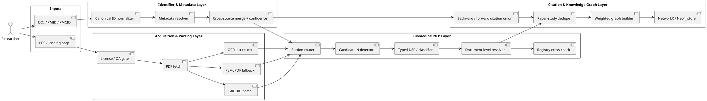
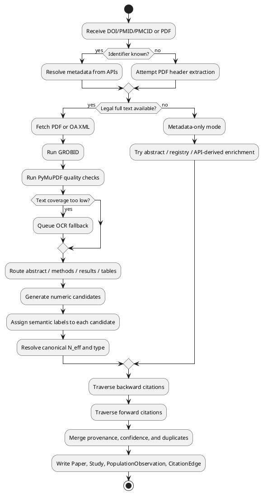
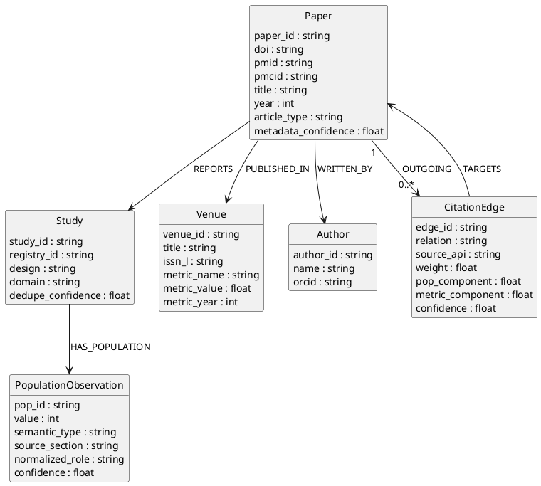
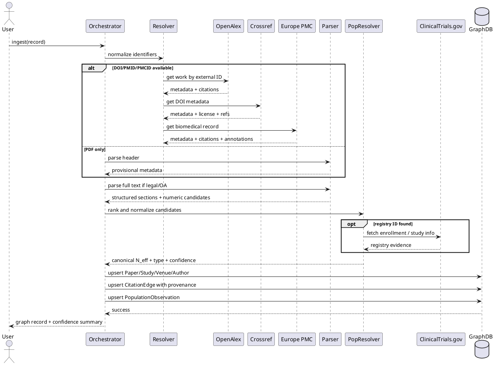

# Feasibility of an Automated Biomedical NLP Citation Graph Pipeline

## Executive summary

Assuming a biomedical or clinical corpus by default, the proposed system is **feasible end to end**, but only as a **hybrid, confidence-aware pipeline** rather than a single fully automatic extractor. The strongest parts are identifier resolution, bibliographic metadata extraction, and citation-graph construction. The weakest parts are detecting the **correct study population/sample size** from heterogeneous paper text and combining that signal with a defensible journal metric. Recent evidence is consistent on that split: GROBID performs well on born-digital scholarly PDFs for metadata and references, while recent clinical-trial extraction work still treats numerical evidence extraction as an open challenge, and the newest full-text LLM benchmark for meta-analysis extraction still recommends human oversight for high-risk fields. citeturn11view1turn13view0turn19view4turn36view0turn38view1turn36view1turn37view0

For a practical build, the best public-source backbone in the biomedical setting is **Europe PMC + PubMed + OpenAlex + Crossref**, with **Semantic Scholar** as optional enrichment and registry cross-checks from entity["organization","ClinicalTrials.gov","nih trial registry"] when NCT identifiers are present. Europe PMC is especially valuable because it is domain-specific and exposes citation network data, reference lists for more than 19.4 million publications, and text-mined annotations; OpenAlex is the broadest open scholarly graph and supports DOI/PMID/PMCID lookup plus citation links and source-level metrics; Crossref remains the DOI-registration anchor for metadata, licenses, and publisher-deposited full-text/TDM URLs; PubMed/E-utilities remain the canonical biomedical indexing layer; and Semantic Scholar provides useful paper/citation APIs and batch endpoints, but under a more restrictive license regime for many uses. citeturn35search2turn9search1turn9search14turn32search2turn32search5turn41view0turn27search8turn0search1turn27search4turn34search0

The project is most realistic if it is framed as a **paper-and-study-level graph with uncertainty**, not as a claim that every edge weight reflects a perfectly extracted “true N.” If official **Journal Impact Factor** is mandatory, the main constraint is not modeling but access and licensing, because Clarivate’s Journal Citation Reports is a licensed product. If alternatives are acceptable, the workflow becomes much easier because CiteScore is freely accessible on Scopus, OpenAlex exposes a 2-year mean citedness field, and SJR is publicly available. Both Clarivate and Elsevier explicitly advise against using any single journal metric in isolation, which means population size should dominate the edge-weight formula and journal metrics should be a secondary term after year/field normalization. citeturn41view2turn22search4turn41view3turn23search0turn21search2

At **≤100 papers**, a credible prototype is realistic on one machine in a few weeks. At **1k–10k papers**, the system remains operationally reasonable if parsing is queued and API responses are cached. At **100k+**, API-only ingestion becomes the wrong strategy: OpenAlex explicitly offers a free bulk snapshot, Semantic Scholar publishes datasets, and persistent graph storage becomes preferable to notebook-scale experimentation. citeturn41view1turn33search15turn27search0turn13view0turn14view3

## Assumptions and feasibility judgment

This report assumes the target corpus is **biomedical or clinical research**, mostly journal articles, with a mixture of DOI-known records, PubMed-indexed records, and PDFs; that the desired graph is directed; and that “population/sample size” means a normalized study-size signal such as *randomized total*, *analyzed total*, *enrolled total*, or *arm/group counts*, not merely any number that appears in a paper. That assumption matters because biomedical literature has unusually strong public infrastructure around identifiers, abstracts, full text, registries, and citation metadata. citeturn35search5turn9search3turn30search11turn34search1

The most important architectural conclusion is that feasibility depends on going **identifier first, PDF second**. If a DOI, PMID, PMCID, or NCT number is present, the system should resolve and merge metadata from APIs before parsing full text. That approach lowers cost, improves recall, and gives the parser priors for journal, year, article type, and likely study design. It also allows a “metadata-only” or “citation-only” path for papers where legal full-text acquisition fails. Crossref explicitly positions itself as metadata infrastructure rather than a full-text store, OpenAlex supports direct lookup by DOI/PMID/PMCID, and Europe PMC plus PubMed provide a strong biomedical identification and enrichment layer. citeturn8search2turn32search2turn35search2turn9search14

The table below turns the literature and documentation into **engineering success-rate estimates**. These are not benchmarked guarantees; they are deployment-oriented ranges inferred from official API capabilities, recent extraction papers, and parser benchmarks. citeturn13view0turn19view4turn36view0turn38view1turn36view1turn28view0turn29view4

| Subtask | Feasibility | Likely success rate on biomedical/clinical corpora | Why |
|---|---:|---:|---|
| DOI/PMID/PMCID → metadata normalization | High | 95–99% when identifiers exist | Mature APIs; canonical identifiers; merge across multiple sources |
| PDF-only title/authors/year/journal extraction | Medium-high | 75–90% on born-digital PDFs; much lower on scanned PDFs | Scholarly parsers are strong, but layout/noise/scans still matter |
| Backward citation extraction | High | 85–98% on DOI-rich records when APIs are combined | OpenAlex/Europe PMC/Crossref can all contribute |
| Forward citation traversal | Medium-high | 75–95%, source-dependent | Coverage varies by provider and openness |
| Population/sample-size candidate detection | Medium | 70–90% candidate recall in clear single-study papers | Numbers are easy to find; hard part is choosing the right one |
| Population/sample-size normalization to the correct semantic type | Medium-low | 55–80% | Ambiguity around enrolled/randomized/analyzed/completed/event counts |
| Official JIF join | Medium-low | 20–60% without licensed access; 85–95% with licensed access and clean ISSN joins | JCR access/licensing is the bottleneck |
| Alternative metric join | High | 80–98% | CiteScore, OpenAlex 2-year mean citedness, and SJR are easier to obtain |
| Directed KG construction and analytics | High | >95% once records are normalized | Graph representation itself is straightforward |

The immediate implication is that an MVP should **promise excellent metadata and useful graph connectivity**, while treating sample-size extraction as a **probabilistic evidence signal** with provenance, confidence, and type labels. A system that silently converts “missing” or “ambiguous” into “0” will be analytically misleading. citeturn19view4turn36view0turn36view1

## End-to-end component assessment

### Metadata and identifier resolution

Metadata extraction for title, authors, DOI, year, and journal is the **most mature** part of the system. Crossref’s REST API exposes depositor metadata including contributors, dates, titles, licenses, funding data, and sometimes abstracts; OpenAlex can fetch a single work by DOI, PMID, or PMCID; and biomedical records can be stabilized with PubMed and Europe PMC. The main caveat is that Crossref’s metadata quality depends on what members deposit and maintain, and some valuable fields remain optional or unevenly populated. citeturn8search1turn32search4turn32search14turn32search10turn32search2turn35search2

A recent comparative literature stream is encouraging for OpenAlex, but it also argues for caution. A 2025 evaluation found OpenAlex suitable for citation analysis in most fields and, in that study, better than Scopus for citation counts on the evaluation task; another 2025 comparison in nursing found that OpenAlex indexed nearly all journals covered by Scopus and Web of Science plus additional sources, and more citations at the article level. At the same time, a 2025 Scientometrics study found metadata-quality caveats, including lower abstract coverage than proprietary databases in a shared corpus, volatile data curation, and cases that warranted caution for scientometric use. For this pipeline, that means OpenAlex is excellent as an open backbone, but merged records still need **field-level provenance** and conflict resolution. citeturn28view0turn28view2turn29view4

### PDF parsing and structured text extraction

For born-digital scholarly PDFs, the best current open baseline remains **GROBID**, augmented by a fast low-level extractor such as **PyMuPDF**. GROBID’s own documentation describes it as a machine-learning library for scholarly PDF-to-TEI conversion, reports around **0.87 F1** for reference parsing on an independent PubMed Central set and around **0.90** on a comparable bioRxiv set, and shows title extraction in the 92–98 F1 range under soft or Levenshtein matching on its PMC benchmark. The same benchmark reports processing 1,943 PMC PDFs in 1,467 seconds, or about **0.75 s per PDF**, on a 16-CPU machine with GPU assistance. citeturn11view1turn13view0

That said, the official benchmark notes are explicit that end-to-end metrics are affected by PDF noisiness, encoding errors, and cascading failures, so benchmark numbers should be read as “relative indicators” rather than deployment guarantees. PyMuPDF is useful because it exposes block-, word-, HTML-, and JSON-level text structures and can reorder text for reading order, but its documentation also notes that the default extraction order may not match natural reading order. In practice, GROBID should own the scholarly-structure path and PyMuPDF should supply layout-aware fallback features, quality checks, and table/region extraction when GROBID output looks suspicious. citeturn11view3turn11view1

Recent parser research reinforces the need for a hybrid design. A 2024 comparative study across six document categories found that scientific articles remain among the hardest document types for text extraction, even when rule-based parsers perform well in easier categories; a 2025 MLSys paper on adaptive PDF parsing highlights common failure modes such as scrambled words, corrupted identifiers, and even dropped pages; and work on scanned scholarly documents reiterates that GROBID-like born-digital parsers often fail on image-based PDFs. End to end, PDF parsing is therefore **feasible but brittle**, especially outside born-digital journal articles. citeturn15view0turn15view1turn39search10

### Population and sample-size extraction

This is the **hardest substantive NLP task** in the proposed pipeline. The literature shows that extracting *a number* is much easier than extracting the **right study-size number**. The 2022 “Sample Size Extractor for RCT Reports” paper is especially relevant: on a COVID RCT abstract set, its best exact-match F1 reached **0.80** and best loose-match F1 reached **0.85**, but performance dropped notably for abstracts containing multiple sample-size entities. The authors’ error analysis states that distinguishing total sample size from other patient counts remains the most challenging problem, and their system could not reason over separate arm sizes to reconstruct a missing total. citeturn19view4

More recent work confirms that the difficulty generalizes from abstracts to full text and from “total N” to broader numeric evidence extraction. A 2024 study on automatic extraction of numerical results from randomized trials found that large-context LLMs are promising but still perform poorly when outcomes are complex and the task requires inference; the 2025 EMNLP numeric-reasoning paper argues that extracting structured numerical evidence remains a bottleneck and reports up to a **21-point absolute F1 improvement** over retrieval-based systems with a reasoning-driven extraction pipeline; and a 2026 benchmark across multiple meta-analysis domains concludes that current LLMs are useful assistants but are **not yet reliable enough for full automation**, especially for statistical results and completeness-sensitive tasks. citeturn36view0turn38view1turn36view1

The broader BioNLP evidence points in the same direction. A 2025 Nature Communications benchmark across 12 biomedical NLP datasets found that established fine-tuned biomedical models still outperform zero- and few-shot LLMs in most tasks, with especially large gaps in information extraction, and warned about missing information, inconsistencies, and hallucinations. For this project, that means the most realistic design is **not** “parse the whole PDF with an LLM and trust the JSON.” It is “generate candidate counts with rules and supervised biomedical models, then optionally use an LLM only as a constrained adjudicator.” citeturn37view0

### Citation traversal and completeness

Citation traversal is technically straightforward but **coverage-completeness is source-dependent**. OpenAlex is now a very large open scholarly graph and exposes referenced works and cited-by counts; Crossref exposes references when members deposit them, but reference registration is optional; Europe PMC offers a domain-specific open citation network and reference lists for more than 19.4 million publications, while also warning that its citation dataset is smaller than subscription-based services because it is based on open citation data; Semantic Scholar exposes papers, citations, and references through its Academic Graph API and supports batch-oriented access. citeturn25search7turn32search5turn26search0turn35search2turn9search16turn27search8turn7view2turn7view4

The practical consequence is that **backward citation recall** can be quite strong when OpenAlex, Europe PMC, and Crossref are unioned, but no single open provider is complete enough to justify a “single source of truth” claim. Recent OpenAlex assessments are encouraging overall but still report data-quality and volatility issues in some metadata fields and reference representations. This argues strongly for storing **parallel edge provenance** rather than collapsing all source evidence into one irreversible citation edge during ingestion. citeturn29view4turn28view0turn28view1

### Graph construction and edge weighting

Graph construction itself is the least risky engineering component once normalized records exist. For prototyping, **NetworkX** is well-suited because it offers directed and multiedge graph classes; for persistent, queryable knowledge graphs and multi-user access, **Neo4j** is the more appropriate backend. The core design choice is not whether a graph can be built, but **what the graph’s semantic unit is**. Because one clinical study may correspond to multiple papers, the correct schema is almost never paper-only. It should distinguish **Paper** from **Study**, then link population observations and citation relationships with provenance and confidence. citeturn31search11turn31search3turn31search1turn31search2

The recommended navigation and implementation references for this layer are urlGROBID docsturn10search1, urlPyMuPDF docsturn11view2, urlNetworkX docsturn31search11, and urlNeo4j docsturn31search1. Their documentation supports exactly the sort of split this project needs: scholarly-document parsing and structured graph storage rather than ad hoc text scraping. citeturn10search1turn11view2turn31search11turn31search1

The API/source comparison below summarizes the operational trade-offs that matter most for the target pipeline. It is based on official documentation and official product pages. citeturn41view1turn41view0turn35search2turn9search1turn9search14turn27search8turn0search1turn27search4turn34search0turn30search2

| API or source | Best role in this pipeline | Coverage and useful fields | Access, rate, and cost | Recommendation |
|---|---|---|---|---|
| urlOpenAlexturn41view1 | Global graph backbone | DOI/PMID/PMCID lookup, references, cited-by counts, OA/full-text flags, source metrics | Freemium API; free daily usage; free bulk snapshot | Primary cross-domain graph source |
| urlCrossref REST APIturn41view0 | DOI-truth and metadata/licensing anchor | DOI, title, contributors, dates, licenses, TDM/full-text URLs, references if deposited | Open REST access; public/polite modes; Metadata Plus optional | Primary DOI metadata source |
| urlEurope PMC REST APIturn33search0 | Biomedical citations/full text/annotations | Reference lists, citation network, text-mined terms, OA biomedical full text | Public API; no paid gate on core docs | First choice in biomedical |
| urlNCBI E-utilitiesturn9search14 | Canonical biomedical indexing | PMID metadata, PubMed linking, MeSH and record retrieval | 3 rps recommended without key, 10 rps with key | Use for canonical biomedical IDs |
| urlSemantic Scholar APIturn27search8 | Enrichment and extra citation signal | Papers, references, citations, batch endpoints, search | 1 rps without key, 1000 rps with shared key; license restrictions apply | Useful secondary enrichment layer |
| urlClinicalTrials.gov APIturn34search0 | Registry cross-check for enrollment/study design | Enrollment, study type, eligibility, identifiers, outcomes | Public government API | Strong validator when NCT IDs are found |
| urlUnpaywall APIturn30search2 | Legal OA discovery | OA/full-text availability by DOI | Free REST API | Use before attempting PDF scraping |

## Failure modes and risk controls

The dominant failure modes are not exotic; they are **structural**. First, the paper may not have legally mineable full text. Crossref explicitly states that it collects metadata rather than full text, though it may store full-text URLs and licenses for TDM when publishers deposit them. PMC is also not a blanket permission source: the PMC Open Access Subset allows reuse, but not all PMC content is reusable for text mining. If the pipeline ignores that distinction and treats every landing page as parseable full text, it will fail operationally and create legal risk. citeturn8search2turn30search3turn30search6

Second, even when full text is available, the paper may not be a clean single-study RCT article. Secondary analyses, pooled analyses, subgroup papers, protocols, and follow-up papers all produce numeric mentions that look like sample sizes but do not represent the study-level total you want. The 2022 sample-size extractor paper is explicit that multiple size mentions sharply reduce precision and that distinguishing true total sample size from related counts is the core challenge. The 2025 and 2026 numerical-evidence papers reinforce that multi-outcome and multi-document reasoning remains difficult even for modern LLMs. citeturn19view4turn38view1turn36view1

Third, open citation graphs are not complete in the way a subscription service might be. Europe PMC itself notes that its citation dataset is smaller than subscription-based services because it is built from open citation data. Crossref reference coverage depends on member deposits, and recent OpenAlex comparison work still recommends caution for some metadata and reference-quality scenarios. The right answer is not to demand perfection from one source; it is to **model incompleteness explicitly**. citeturn9search16turn26search0turn29view4

The risk matrix below translates those findings into concrete controls. Severity and likelihood are engineering judgments derived from the cited literature and documentation. citeturn19view4turn36view0turn36view1turn11view1turn39search10turn26search0turn9search16turn29view4

| Risk | Likelihood | Impact | Why it happens | Recommended mitigation |
|---|---|---|---|---|
| No legal PDF access | High | High | Landing page exists but no reusable full text | Add license/OA gate; use metadata-only mode when blocked |
| Scanned or image-only PDF | Medium | High | Born-digital parsers fail on scans | Detect low text coverage; OCR only as a last resort |
| Multiple N-like numbers in one paper | High | High | Enrollment, randomized, analyzed, completers, events all appear | Predict semantic type, not just numeric value |
| Arm sizes reported but total missing | Medium | High | Paper lists group Ns separately | Add arithmetic consistency logic and registry cross-check |
| Tables/figures contain the decisive counts | Medium | High | Narrative text omits totals | Add table-region extraction and figure-aware fallbacks |
| Multi-study or pooled paper | Medium | High | One paper may summarize several cohorts/trials | Separate Paper and Study nodes |
| Metadata disagreement across APIs | High | Medium | Depositor inconsistencies and graph curation differences | Field-level provenance and deterministic precedence rules |
| Citation incompleteness | High | Medium | Open citation coverage varies by provider | Store source-specific edges and completeness scores |
| Preprint/journal duplicate records | Medium | Medium | Same study appears in multiple versions | Version clustering via DOI, PMID, title-year, registry ID |
| Official JIF unavailable | High | Medium | JCR access is licensed | Use CiteScore/OpenAlex/SJR fallback stack |

A subtle but important edge case is that “population” may not even refer to participants. In biomedical articles, numbers may refer to specimens, images, sites, visits, lesions, or records. A system optimized only for the token pattern `n=123` will overcount false positives unless the value is attached to a semantic type such as **participant total**, **arm total**, **analyzed set**, or **event count**. That is why a schema with typed population observations is safer than a single `paper.sample_size` field. citeturn19view4turn38view1

## Recommended architecture and implementation details

The most robust revised design is an **identifier-first, confidence-aware, study-aware** pipeline.

The recommended source priority is: first, resolve identifiers and metadata; second, determine whether the paper has legal full text; third, parse and route sections; fourth, extract and normalize candidate population values; fifth, traverse citations; and only then persist the merged graph. In the biomedical setting, it is worth adding related infrastructure services that were not explicitly named in the original request: entity["organization","Europe PMC","ebi literature service"] for biomedical citations and annotations, entity["organization","PubMed","nih literature database"] and entity["organization","PubMed Central","nih full-text archive"] for canonical biomedical indexing/full text, and registry validation through entity["organization","ClinicalTrials.gov","nih trial registry"]. citeturn35search2turn9search1turn9search14turn30search11turn34search1

### Recommended module stack

For **metadata merging**, use deterministic field precedence instead of “first API wins.” A pragmatic starting rule is: DOI, license, ISSN, and journal-title truth from Crossref when a DOI exists; title/year/source/citation links from OpenAlex as the open graph backbone; PMID/PMCID and biomedical routing from PubMed/Europe PMC; and additional citation enrichment from Semantic Scholar only when licensing and rate constraints are acceptable. Crossref’s own documentation emphasizes metadata cleanliness and completeness, and OpenAlex’s recent evaluation literature justifies keeping provenance because quality varies by field and metadata type. citeturn32search4turn32search14turn28view0turn29view4

For **PDF parsing**, use GROBID as the primary scholarly parser and PyMuPDF as a quality-control and fallback layer. A practical quality gate is: if the parser returns no title, too few references relative to API reference counts, extremely low page-level character density, or obvious ordering corruption, rerun with alternate extraction settings or put the paper into a “manual review / OCR candidate” queue. OCR should be triggered only when text coverage is clearly inadequate, because the evidence shows that OCR/scanned inputs remain a materially different problem class from born-digital PDFs. citeturn11view1turn11view3turn15view1turn39search10

For **population/sample-size extraction**, the recommended design is a three-stage hybrid:
1. **Candidate generation** with rules and section priors. Search for patterns like `n=`, `N=`, “patients,” “participants,” “randomized,” “enrolled,” “analyzed,” “completed,” and arm labels in abstract, methods, results, CONSORT-like sections, and participant-flow material.
2. **Sequence labeling / mention typing** with a biomedical token-classification model. The label set should include at least `TOTAL_RANDOMIZED`, `TOTAL_ENROLLED`, `TOTAL_ANALYZED`, `ARM_SIZE`, `COMPLETERS`, `EVENT_COUNT`, `SCREENED`, and `FOLLOWUP_COUNT`.
3. **Document-level resolution** that selects a canonical `N_eff` and a semantic type, rather than a bare integer. This resolver should use model confidence, section prior, lexical cues, arithmetic consistency across arms, and registry agreement when an NCT number is available. citeturn19view4turn36view0turn38view1turn37view0

A concrete scoring function for document-level population resolution is:

`score(candidate) = 0.40 * p_model + 0.20 * p_section + 0.20 * p_consistency + 0.15 * p_registry + 0.05 * p_metadata`

where `p_section` is highest in abstract methods/results, participant-flow, and trial design passages; `p_consistency` rewards candidates that equal the sum of arm sizes or agree across repeated mentions; and `p_registry` rewards agreement with ClinicalTrials.gov enrollment when a registry match exists. Those coefficients are good starting values because the literature suggests that the hardest failure is not candidate recall but **semantic disambiguation**, so model confidence alone should not dominate. Tune them by grid search or Bayesian optimization on a labeled validation set. citeturn19view4turn36view1

For **LLM use**, the best role is constrained adjudication, not first-pass extraction. The 2025 Nature benchmark and the 2026 meta-analysis benchmark both caution that generic LLM extraction still suffers from omission and hallucination. A safer design is to pass the LLM only the top-ranked candidate snippets and require it to choose among typed candidates or return `AMBIGUOUS`. That preserves auditability and reduces the attack surface for hallucinated counts. citeturn37view0turn36view1

For **citation traversal**, build the graph as a **union of source-specific evidence**. Recommended priority in biomedical workflows is Europe PMC and OpenAlex first, Crossref as supplemental backward-reference evidence, and Semantic Scholar only as optional enrichment. Edge records should keep `source_api`, `retrieved_at`, `evidence_count`, and `confidence` fields, and merged edges should preserve the list of contributing sources. This avoids silently overstating completeness when one source is missing or lagging. citeturn35search2turn26search0turn9search16turn29view4

For **graph representation**, start with a `MultiDiGraph` in NetworkX during prototyping so that multiple source-specific citation edges can co-exist. When record counts grow and persistence/queryability matter, promote the same schema into Neo4j. In both backends, model **Paper** and **Study** separately. That is essential for clinical literature because multiple papers can map to the same registered or inferred trial, and the population signal belongs to the **study**, not always to the individual paper. citeturn31search3turn31search11turn31search1turn38view1

### Edge-weight formula

The cleanest starting point is to make the citation-edge weight depend on the **cited study**, not the citing study, because the goal is usually to represent the strength of evidence being cited.

Define:

- `N_eff` = preferred study-size signal in this order: randomized total > analyzed total > enrolled total > registry estimate > missing.
- `N*` = `log1p(N_eff) / log1p(P95(N_eff))`, clipped to `[0,1]`.
- `J*` = year- and field-normalized journal metric percentile in `[0,1]`, using JIF if licensed, otherwise CiteScore or OpenAlex 2-year mean citedness.

Then start with:

`w_ij = α * N*_j + β * J*_j`

with **`α = 0.75` and `β = 0.25`**.

That split is recommended because journal metrics are noisy and should not overpower directly relevant study-size evidence, and because both Clarivate and Elsevier advise against treating journal metrics as standalone decision criteria. If extraction confidence should also affect the weight, multiply by a confidence term instead of adding a third component:

`w_final = w_ij * c_pop`

where `c_pop` is the calibrated confidence of the selected `N_eff`. A practical sensitivity sweep is `α ∈ {0.60, 0.70, 0.75, 0.80, 0.90}` with stability checks on node rankings and community detection. citeturn41view2turn41view3turn23search0

### Evaluation metrics

The pipeline should be evaluated module by module and end to end.

For metadata, use DOI exact match, year exact match, journal/ISSN-L exact match, author precision/recall, and relaxed title similarity. For population extraction, use mention-level span F1, semantic-type accuracy, document-level exact-match accuracy for `N_eff`, loose accuracy within 10%, arithmetic-consistency rate across arms, and abstention quality on ambiguous cases. For citations, use edge precision/recall on a manual gold set, reference-count correlation with source APIs, source-agreement rate, duplicate-merge error rate, and graph-completeness flags. For edge weights, evaluate downstream stability: if centrality rankings or clusters change dramatically under small α/β perturbations, the weighting scheme is too fragile for analytic use. Those choices align with both the sample-size extraction literature and recent evaluation practice in automated evidence synthesis. citeturn19view4turn36view0turn38view1turn36view1

## Development plan and scalability

A realistic development plan is **15–24 engineer-weeks** for a robust prototype and **one part-time domain reviewer** for annotation design, manual adjudication, and evaluation. The recommended milestone sequence is: metadata/identifier layer first, parser quality gates second, population extraction and resolver third, graph persistence and analytics fourth, and legal/licensing hardening last. This ordering matters because metadata and citation APIs will provide labels, priors, and fallbacks that make later PDF work more reliable. citeturn41view0turn41view1turn13view0turn19view4

A pragmatic milestone plan looks like this. In the first two weeks, build identifier normalization, metadata merging, schema, and caching. In weeks three to five, add Europe PMC/OpenAlex/Crossref traversal, legal OA checks, and baseline graph ingestion. In weeks six to nine, bring up GROBID, quality gates, and PyMuPDF-based fallback extraction. In weeks ten to fourteen, implement typed sample-size extraction and the document-level resolver plus registry validation. In weeks fifteen to eighteen, move from NetworkX prototype analyses to a persistent graph representation and add evaluation dashboards. Reserve additional time if scanned-PDF support, figure extraction, or institutional JCR integration is mandatory. citeturn13view0turn14view3turn19view4turn36view1

The scale-specific architecture below reflects benchmark runtimes, official API access models, and the need to shift from synchronous APIs to bulk data at 100k+ scale. These compute/storage figures are engineering estimates, not vendor guarantees. citeturn13view0turn14view3turn41view1turn27search0turn9search2turn0search1

| Scale | Recommended architecture | Compute profile | Storage profile | Main bottleneck |
|---|---|---|---|---|
| Small, ≤100 papers | API-first; local cache; GROBID container; NetworkX + SQLite/Postgres | 8 vCPU, 16–32 GB RAM; GPU optional | Tens of GB is ample | Manual error analysis, not infrastructure |
| Medium, 1k–10k papers | Worker queue; persistent cache; GROBID service; NetworkX or Neo4j; registry cross-checks | 16–32 vCPU, 64–128 GB RAM; one modest GPU helps for model tuning | Hundreds of GB comfortable if PDFs are retained | PDF parsing throughput and API throttling |
| Large, 100k+ papers | Bulk snapshots, object storage, distributed workers, persistent graph DB, source-specific provenance | Multi-node CPU pool; optional training GPU(s); 256 GB+ RAM aggregate | TB-scale if PDFs and parsed artifacts are stored | Bulk ingestion, deduplication, and graph maintenance |

At large scale, OpenAlex’s documentation makes the direction explicit: the bulk snapshot is free, and the API is a freemium service; similarly, Semantic Scholar publishes dataset and batch-oriented access options. This is not just a cost issue. It is also a correctness issue, because large-scale API crawling increases the chance of partial refreshes, transient errors, and inconsistent snapshots across multiple providers. citeturn41view1turn33search15turn27search0

## APIs, journal metrics, and governance

The recommended source priority for the biomedical default is: urlEurope PMC REST APIturn33search0 first for biomedical literature, citations, and text-mined annotations; urlOpenAlex API docsturn41view1 second as the global open graph backbone; urlCrossref REST APIturn41view0 third as the canonical DOI metadata and licensing anchor; urlNCBI E-utilitiesturn9search14 for PubMed/PMC linkage and canonical biomedical indexing; urlSemantic Scholar APIturn27search8 only as an enrichment layer; and urlClinicalTrials.gov APIturn34search0 for enrollment and design validation when registry linkage is available. In other words, the most reliable design is **not** to choose exactly one source. It is to designate a **primary source per field** and preserve provenance at merge time. citeturn35search2turn9search1turn32search2turn41view0turn9search2turn27search8turn27search4turn34search1

For journal metrics, use this fallback stack: if you have licensed access to entity["company","Clarivate","research analytics company"] via urlClarivate JCRturn41view2, use official JIF; otherwise prefer entity["organization","Scopus","elsevier citation index"]-based urlScopus CiteScoreturn41view3 because it is freely accessible and better documented than ad hoc journal lists; if that is still unavailable, use the urlOpenAlex source metrics docsturn23search0 and their 2-year mean citedness as an open substitute; if a prestige-style metric is desired, use urlSCImago Journal Rankturn21search2 as a tertiary fallback. Whatever metric is chosen, join on **ISSN-L first**, then ISSN variants, then normalized title. citeturn41view2turn22search4turn41view3turn23search0turn21search2

Legal and ethical considerations are not peripheral here. Crossref can expose TDM/full-text URLs and license metadata, but that does not eliminate publisher copyright. PMC is safe only where the article is in the Open Access Subset or another explicitly reusable set. Semantic Scholar’s FAQ is clear that it cannot grant permission to redistribute paper content, and its API license defaults to internal non-commercial research/education unless a broader license is arranged. The safest operational rule is therefore: **persist metadata, extracted spans, and provenance; do not redistribute full copyrighted text or PDFs unless the license clearly allows it**. citeturn8search2turn30search3turn30search6turn27search17turn27search4

There is also a methodological ethics issue. Journal metrics are field-sensitive and may amplify publication prestige rather than evidentiary relevance. Clarivate says JIF should not be used in isolation, and Elsevier similarly recommends multiple metrics and qualitative input. In this pipeline, that means journal metrics are acceptable as a **secondary weighting term**, but they should never dominate the graph. If the project is meant to support evidence synthesis, then participant/sample-size signals and extraction confidence should have precedence over venue prestige. citeturn41view2turn41view3

## Prototype validation and PlantUML diagrams

A strong prototype validation plan should use three complementary test sets: a **clean OA RCT set** for basic end-to-end success, a **stress set** containing multi-arm, multi-size, and registry-linked papers, and a **failure set** containing scanned PDFs, inaccessible full text, and multi-study/secondary-analysis papers. The public **SPIRIT-CONSORT-TM** corpus is useful for sentence-level reporting-item detection and general clinical-publication structure, while recent numerical-evidence work such as the COCHRANEFOREST line of papers provides a more realistic picture of downstream numeric reasoning difficulty. In practice, the most useful gold set will still be a **custom manually labeled set of 100–200 OA biomedical papers** with study-size labels, semantic type labels, and citation-edge verification. citeturn38view0turn38view1turn36view1

Reasonable phase-gate success criteria for a first serious prototype are: metadata exact-match accuracy of at least **97%** on DOI-known records; relaxed title/year/journal success of at least **90%** on born-digital PDF-only records; document-level exact total-`N_eff` accuracy of **80%** on single-study OA RCTs and loose accuracy within 10% of **90%**; semantic-type accuracy of at least **85%** for distinguishing randomized/analyzed/enrolled/arm counts; backward-citation precision of **95%** and recall of **85%** on a manually adjudicated citation set; duplicate false-merge rate below **1%**; and abstention on genuinely ambiguous population cases rather than forced extraction. Those targets are ambitious but realistic relative to the recent extraction literature. citeturn19view4turn36view0turn38view1turn36view1

The diagrams below encode the architecture recommended in this report.

