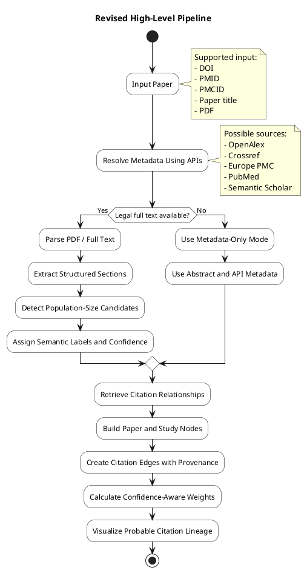
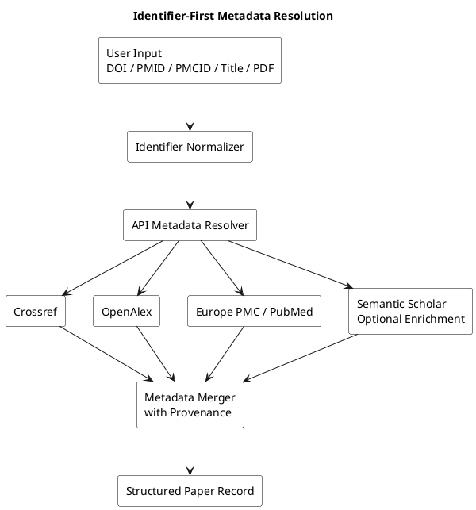
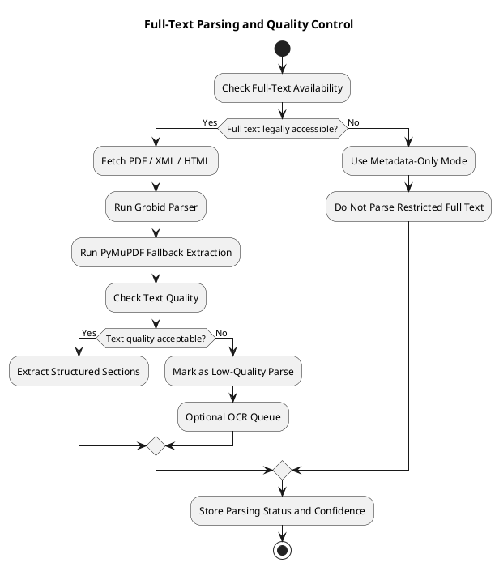
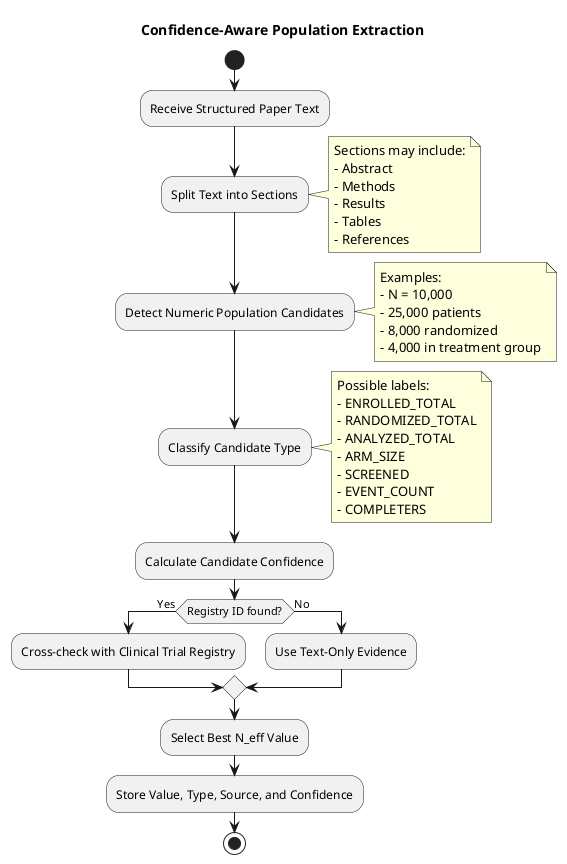
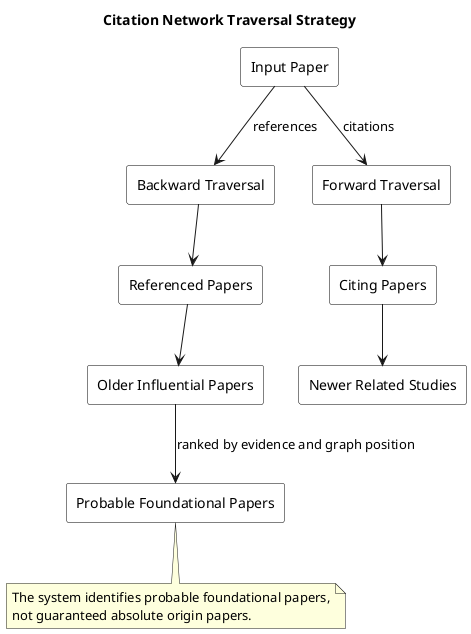
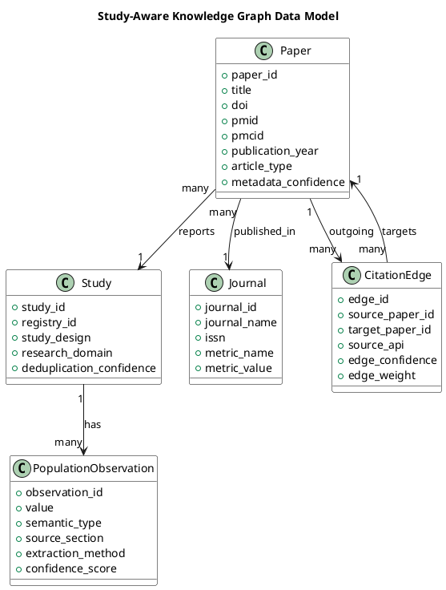
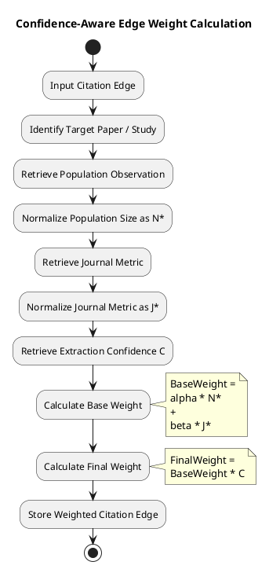
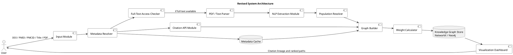
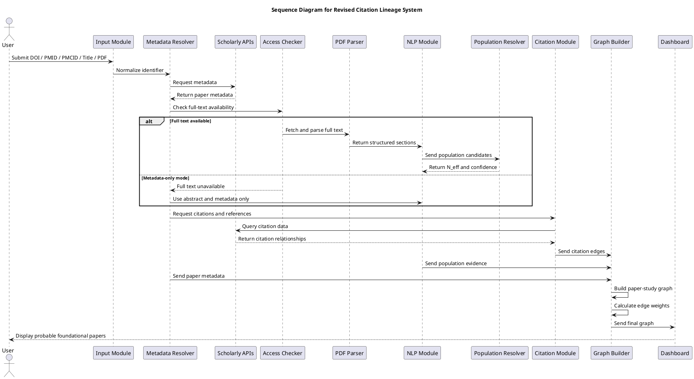

# **National University of Technology**

## **Computer Science Department**

**Semester:** Spring 2026
**Program:** Artificial Intelligence
**Course:** Natural Language Processing
**Course Code:** CS386

|       Submitted To      |     |
| :---------------------: | :-: |
| **Lec. Rooshan Saleem** |     |

---

# **Project Proposal**

## **Confidence-Aware Citation Lineage and Study-Scale Knowledge Graphs**

---

## **1. Team Members**

| Name                  | Registration Number |
| :-------------------- | :------------------ |
| **Muhammad Usman**    | F23607004           |
| **Ahad Imran**        | F23607034           |
| **Zain-Ul-Abidin**    | F23607031           |
| **Raja Mahad**        | F23607035           |
| **Hamza Abdul Karim** | F23607046           |

---

## **2. Revised Project Title**

**Confidence-Aware Citation Lineage Extraction and Study-Scale Knowledge Graph Construction Using NLP**

---

## **3. Introduction and Abstract**

The rapid growth of scientific literature has made it difficult for researchers to understand how research ideas develop over time. A single research paper may cite dozens of earlier studies, while those studies may further cite other related works. This makes it challenging to identify the most influential, foundational, or evidence-rich papers behind a research topic.

The original idea of this project was to automatically trace citation hierarchies back to a single parent paper and weight citation relationships using dataset population size and journal impact factor. After feasibility analysis, the project has been revised into a more realistic and research-valid approach. Instead of claiming perfect automatic origin detection, this project will identify **probable foundational papers** using citation networks, metadata, study population signals, and confidence scores.

This project proposes an NLP-based pipeline that accepts a research paper using a DOI, PMID, PMCID, paper title, or PDF. The system will first resolve metadata using public scholarly APIs. If full text is legally available, the system will parse the paper and extract useful information such as title, authors, publication year, references, study design, and population-size mentions. Since extracting the correct sample size from research papers is difficult, the system will not treat every extracted number as final. Instead, it will generate candidate population values, assign semantic labels such as enrolled population, randomized population, analyzed population, or arm size, and then calculate confidence scores.

The final output will be a **directed Knowledge Graph** where papers, studies, journals, population observations, and citation relationships are modeled separately. This makes the system more accurate because one study may be reported in multiple papers. The graph will help users visualize citation lineage, identify probable foundational papers, and rank citation paths using study-scale evidence and confidence-aware weighting.

---

## **4. Problem Statement**

Current literature search systems usually provide lists of papers based on keywords, citation counts, or relevance scores. However, they do not clearly show how a research idea evolved through earlier studies. Citation counts alone are also insufficient because a highly cited paper is not always the strongest source of evidence.

In biomedical and clinical research, population size is an important signal because larger studies often provide stronger evidence. However, automatically extracting the correct population size from research papers is challenging. Papers may mention several different numbers, such as screened patients, enrolled patients, randomized patients, analyzed patients, completed participants, event counts, or subgroup sizes.

Therefore, this project aims to solve the following problem:

> How can NLP and Knowledge Graphs be used to construct a confidence-aware citation lineage system that identifies probable foundational papers and ranks citation paths using study-scale evidence?

---

## **5. Revised Feasibility-Based Scope**

This project is feasible as a **prototype**, but it should not claim complete automation or perfect accuracy. The revised scope focuses on building a reliable and explainable system with confidence scores.

### **Included in Scope**

* DOI, PMID, PMCID, title, or PDF-based paper input
* Metadata extraction using APIs and PDF parsing
* Citation network construction using scholarly metadata sources
* Candidate sample-size extraction using NLP and rule-based methods
* Confidence scoring for extracted population values
* Paper-level and study-level Knowledge Graph modeling
* Visualization of probable citation lineages
* Ranking of citation paths using population signal, journal metric, and confidence

### **Not Claimed in Scope**

* Perfect extraction of all sample sizes
* Guaranteed discovery of the absolute first parent paper
* Complete citation coverage from all global research databases
* Fully automatic clinical evidence extraction without ambiguity
* Official Journal Impact Factor integration unless licensed access is available

---

## **6. Project Objectives**

The main objectives of this project are:

1. **Identifier-First Metadata Resolution**
   Resolve paper information using DOI, PMID, PMCID, or title before attempting PDF parsing.

2. **PDF and Text Parsing**
   Extract structured text from research papers using tools such as Grobid and PyMuPDF.

3. **Citation Network Construction**
   Retrieve backward references and forward citations using APIs such as OpenAlex, Crossref, Europe PMC, PubMed, and Semantic Scholar.

4. **Population Candidate Extraction**
   Detect candidate population-size mentions such as enrolled participants, randomized participants, analyzed patients, and arm sizes.

5. **Confidence-Aware Population Resolution**
   Assign confidence scores to extracted values instead of assuming that every number is correct.

6. **Study-Aware Knowledge Graph Modeling**
   Separate **Paper** nodes from **Study** nodes because one study may be represented by multiple publications.

7. **Weighted Citation Path Ranking**
   Rank citation paths using normalized population size, journal metric, and extraction confidence.

8. **Graph Visualization**
   Provide a visual representation of probable foundational papers and citation relationships.

---

# **7. Proposed System Overview**

The revised system follows an **identifier-first, PDF-second** strategy. This means the system first tries to resolve paper metadata using APIs. PDF parsing is only used when metadata or full-text information is required and legally accessible.

## **Figure 1: Revised High-Level Pipeline**

---

# **8. Methodology**

The proposed methodology is divided into six phases.

---

## **Phase 1: Identifier and Metadata Resolution**

The first phase will focus on resolving the identity of the input paper. If the user provides a DOI, PMID, PMCID, or paper title, the system will query scholarly APIs before attempting PDF parsing. This improves reliability because public APIs often already contain structured metadata such as title, authors, publication year, journal name, abstract, references, and citation counts.

The system will combine metadata from multiple sources and keep track of where each field came from. This is important because metadata may differ slightly across APIs.

### **Metadata Fields to Extract**

* Title
* Authors
* DOI
* PMID / PMCID
* Publication year
* Journal name
* Abstract
* References
* Citation count
* Source API
* Confidence score

---

## **Figure 2: Metadata Resolution Flow**

---

## **Phase 2: Legal Full-Text Access and PDF Parsing**

If full text is available, the system will parse the PDF or available XML/HTML full text. However, the system will avoid assuming that every PDF can legally or technically be processed. Some papers may not provide full-text access, while some PDFs may be scanned or poorly structured.

For full-text extraction, the system will use:

* **Grobid** for scholarly PDF structure extraction
* **PyMuPDF** for fallback text extraction and layout inspection
* **OCR only as a last resort** for scanned PDFs

The extracted text will be divided into meaningful sections such as abstract, introduction, methodology, results, discussion, tables, and references.

---

## **Figure 3: Full-Text Parsing and Quality Check**

---

## **Phase 3: NLP-Based Population Candidate Extraction**

Population-size extraction is one of the most difficult parts of the project. Research papers may contain many numbers, and not all of them represent the study population. For example, a paper may mention:

* 10,000 screened patients
* 8,500 enrolled participants
* 8,000 randomized participants
* 7,650 analyzed participants
* 4,000 patients in treatment group
* 3,650 patients in control group
* 250 adverse events

The system must avoid treating all numbers as the same type of population value.

The revised approach will use a hybrid method:

1. **Rule-Based Candidate Detection**
   Regular expressions will detect phrases such as `N = 10,000`, `10,000 patients`, `sample size of 25,000`, and `cohort of 50,000 participants`.

2. **Section-Based Prioritization**
   Numbers found in the abstract, methods, participant-flow, and results sections will receive higher priority.

3. **Semantic Type Classification**
   Candidate values will be classified into types such as:

   * Total enrolled
   * Total randomized
   * Total analyzed
   * Arm size
   * Screened population
   * Completers
   * Event count
   * Follow-up count

4. **Confidence Scoring**
   Each extracted value will receive a confidence score based on pattern strength, section location, repeated agreement, and possible registry validation.

---

## **Figure 4: Population Candidate Extraction Pipeline**

---

## **Phase 4: Citation Network Traversal**

The system will retrieve citation relationships using scholarly APIs. Citation traversal will include two directions:

### **Backward Citation Traversal**

This retrieves papers cited by the input paper. It helps identify earlier studies that influenced the current paper.

### **Forward Citation Traversal**

This retrieves newer papers that cited the input paper. It helps show how the paper influenced later work.

The system will not claim to find the absolute original paper. Instead, it will identify **probable foundational papers** based on graph depth, citation connectivity, publication year, and evidence weight.

---

## **Figure 5: Citation Traversal Strategy**

---

## **Phase 5: Study-Aware Knowledge Graph Construction**

A major revision in this proposal is the separation of **Paper** and **Study** nodes. This is important because a single clinical study may produce several publications, such as a protocol paper, primary results paper, follow-up paper, and secondary analysis paper.

Instead of storing population size directly as a simple paper attribute, the system will store it as a **Population Observation** connected to a **Study** node.

### **Main Node Types**

* **Paper**
  Represents an individual publication.

* **Study**
  Represents the underlying research study or clinical trial.

* **Population Observation**
  Represents an extracted population-size value with type and confidence.

* **Venue / Journal**
  Represents the publication venue and journal-level metrics.

* **Citation Edge**
  Represents citation relationships between papers.

---

## **Figure 6: Revised Knowledge Graph Data Model**

---

## **Phase 6: Confidence-Aware Edge Weighting**

The original proposal used a formula based on population size and journal impact factor. The revised version improves this by adding confidence and normalization.

The proposed edge weight will be calculated for the cited paper or cited study:

[
Weight = (\alpha \times N^*) + (\beta \times J^*)
]

Then the final confidence-aware weight will be:

[
FinalWeight = Weight \times C
]

Where:

* (N^*) = normalized population-size score
* (J^*) = normalized journal metric score
* (C) = confidence score of extracted population value
* (\alpha) = weight assigned to population evidence
* (\beta) = weight assigned to journal metric

For the prototype:

[
\alpha = 0.75
]

[
\beta = 0.25
]

This means population size will be more important than journal metric. This is a safer approach because journal metrics should not dominate the evidence ranking.

If official Journal Impact Factor data is not available, the system may use alternative journal-level metrics such as OpenAlex source metrics, CiteScore, or SJR.

---

## **Figure 7: Confidence-Aware Weight Calculation**

---

# **9. System Architecture**

The proposed system will be modular. Each module will perform one major task and pass structured output to the next module.

## **Main Modules**

1. **Input Module**
   Accepts DOI, PMID, PMCID, paper title, or PDF.

2. **Metadata Resolver**
   Queries APIs and merges metadata.

3. **Full-Text Access Checker**
   Checks whether the paper can be legally parsed.

4. **PDF Parser**
   Extracts structured text from available full text.

5. **NLP Extraction Module**
   Detects entities, sections, and population-size candidates.

6. **Population Resolver**
   Selects the most likely population value and assigns confidence.

7. **Citation API Module**
   Retrieves references and citing papers.

8. **Graph Builder**
   Creates paper, study, journal, population, and citation nodes.

9. **Weight Calculator**
   Calculates confidence-aware citation edge weights.

10. **Visualization Dashboard**
    Displays the citation lineage and ranked paths.

---

## **Figure 8: Revised System Architecture**

---

# **10. System Execution Sequence**

The following sequence diagram shows how the system processes an input paper.

## **Figure 9: System Sequence Diagram**

---

# **11. Tools and Technologies**

| Category                         | Tools / Technologies                                     |
| :------------------------------- | :------------------------------------------------------- |
| **Programming Language**         | Python 3.10+                                             |
| **Metadata APIs**                | OpenAlex, Crossref, Europe PMC, PubMed, Semantic Scholar |
| **PDF Parsing**                  | Grobid, PyMuPDF                                          |
| **NLP Libraries**                | spaCy, Hugging Face Transformers                         |
| **Pattern Matching**             | Regular Expressions                                      |
| **Graph Processing**             | NetworkX                                                 |
| **Graph Database**               | Neo4j                                                    |
| **Visualization**                | PyVis, Gephi, Streamlit                                  |
| **Data Handling**                | Pandas, NumPy                                            |
| **Optional Registry Validation** | ClinicalTrials.gov API                                   |
| **Diagram Design**               | PlantUML                                                 |

---

# **12. Expected Outcomes and Deliverables**

By the end of this project, the following deliverables are expected:

1. **Metadata Resolution Module**
   A module that retrieves and merges paper metadata from public scholarly APIs.

2. **PDF Parsing Module**
   A module that extracts structured text from legally accessible research papers.

3. **Population Candidate Extraction Module**
   A hybrid NLP and rule-based system for detecting population-size mentions.

4. **Confidence-Aware Population Resolver**
   A method for selecting the most likely population value with a confidence score.

5. **Citation Network Builder**
   A module that retrieves and stores backward and forward citation relationships.

6. **Study-Aware Knowledge Graph**
   A graph structure containing papers, studies, journals, population observations, and citation edges.

7. **Weighted Citation Path Ranking**
   A ranking method using normalized population size, journal metric, and confidence.

8. **Visualization Dashboard**
   A dashboard for displaying citation lineages, probable foundational papers, and ranked citation paths.

9. **PlantUML System Diagrams**
   Renderable design diagrams for system architecture, pipeline, data model, and sequence flow.

---

# **13. Evaluation Plan**

The system will be evaluated module by module.

## **Metadata Evaluation**

The metadata module will be evaluated using:

* DOI match accuracy
* Title similarity
* Publication year accuracy
* Journal name accuracy
* Author extraction accuracy

## **Population Extraction Evaluation**

The population extraction module will be evaluated using:

* Candidate detection accuracy
* Semantic type classification accuracy
* Correct population value selection
* Confidence score reliability
* Error rate for ambiguous cases

## **Citation Graph Evaluation**

The citation graph will be evaluated using:

* Number of retrieved references
* Number of retrieved citing papers
* Duplicate paper detection accuracy
* Citation edge correctness
* Graph connectivity

## **Ranking Evaluation**

The ranking system will be evaluated by checking whether highly ranked paths are reasonable based on:

* Population size
* Journal metric
* Citation depth
* Confidence score
* Manual inspection of selected papers

---

# **14. Limitations**

This project has several limitations:

1. **Citation Coverage May Be Incomplete**
   Public APIs may not contain all references or citations for every paper.

2. **Population Extraction Is Ambiguous**
   A paper may contain many different numbers, and the correct study population may not always be clear.

3. **PDF Parsing May Fail**
   Some PDFs may be scanned, poorly formatted, or legally inaccessible.

4. **Journal Impact Factor May Not Be Available**
   Official Journal Impact Factor usually requires licensed access, so alternative journal metrics may be used.

5. **Foundational Paper Detection Is Probabilistic**
   The system will identify probable foundational papers, not guarantee the absolute first paper.

6. **Biomedical Focus**
   The prototype will work best on biomedical or clinical research papers because these domains have stronger metadata infrastructure.

---

# **15. Significance of the Project**

This project is significant because it combines NLP, citation analysis, and Knowledge Graphs to improve research discovery. Instead of simply counting citations, the proposed system considers study-scale evidence and confidence.

The system can help researchers:

* Understand how a research idea evolved
* Identify probable foundational papers
* Compare citation paths using evidence-based weights
* Detect influential studies with large populations
* Visualize research relationships clearly
* Avoid over-reliance on citation counts alone

The revised approach is more realistic because it accepts uncertainty and models it explicitly using confidence scores.

---

# **16. Conclusion**

This project proposes a confidence-aware NLP and Knowledge Graph system for citation lineage extraction. The system will process research papers using identifier-first metadata resolution, full-text parsing when available, population-size candidate extraction, citation traversal, and graph-based ranking.

Unlike the original idea, the revised project does not claim perfect automatic origin detection or perfect sample-size extraction. Instead, it produces a transparent and explainable graph that identifies **probable foundational papers** and ranks citation paths based on population-size evidence, journal metrics, and confidence scores.

This makes the project technically feasible, academically defensible, and suitable as an NLP course project prototype.